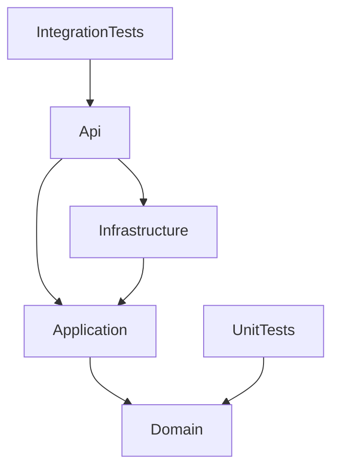

# Giai đoạn 1: Project Initialization

## 1. Mục tiêu Giai đoạn 1
- Khởi tạo kiến trúc source code .NET 8.
- Thiết lập Modular Monolith + Clean Architecture.
- Cấu hình Dependency Injection cơ bản, Swagger, Health Checks.
- Viết integration test đầu tiên kiểm tra setup.

## 2. Kiến trúc đã chọn
- **Modular Monolith + Clean Architecture + Vertical Slice**
- Solution gồm nhiều project tách biệt trách nhiệm: `Api`, `Application`, `Domain`, `Infrastructure`.
- Chia test thành `UnitTests` và `IntegrationTests`.

## 3. Cấu trúc solution thực tế
```text
LuckyWheel.sln
Directory.Build.props
src/
  LuckyWheel.Api/
  LuckyWheel.Application/
  LuckyWheel.Domain/
  LuckyWheel.Infrastructure/
tests/
  LuckyWheel.IntegrationTests/
  LuckyWheel.UnitTests/
```

## 4. Danh sách project và trách nhiệm
- `LuckyWheel.Api`: REST API, endpoint entry point, Cấu hình Swagger & Health check.
- `LuckyWheel.Application`: Chứa Use Case, DTO, Interface (chưa phát triển mạnh ở GD1).
- `LuckyWheel.Domain`: Chứa Core Business Logic, Entities, Enums (độc lập hoàn toàn).
- `LuckyWheel.Infrastructure`: Database configs, external services (chưa cài đặt chi tiết ở GD1).
- `LuckyWheel.IntegrationTests`: Kiểm thử hệ thống (API, database).
- `LuckyWheel.UnitTests`: Kiểm thử logic nghiệp vụ.

## 5. Sơ đồ project references


## 6. Target framework
- `net8.0`

## 7. Package đã cài
- `Swashbuckle.AspNetCore` (Api)
- `Microsoft.Extensions.DependencyInjection.Abstractions` (Application, Infrastructure)
- `Microsoft.Extensions.Configuration.Abstractions` (Infrastructure)
- `xunit`, `Microsoft.NET.Test.Sdk`, `coverlet.collector` (Test projects)

## 8. Dependency Injection đã cấu hình
- API gọi `AddApplication()` và `AddInfrastructure()` để load dependency từ các layer khác.

## 9. Swagger/OpenAPI
- Đã được đăng ký trong `Program.cs` thông qua `AddSwaggerGen` và `UseSwaggerUI`.

## 10. Health Check
- Đã được đăng ký và map endpoint `/health`.

## 11. System API hoặc endpoint kiểm tra
- Tồn tại `SystemController` để kiểm tra kết nối hệ thống.

## 12. Các file cấu hình
- `appsettings.json`
- `appsettings.Development.json`
- `appsettings.Development.json.example`

## 13. Test được tạo trong Giai đoạn 1
- `IntegrationTests/ApiAssemblyTests.cs`: Đảm bảo API load đúng thành phần.
- `UnitTests/DomainAssemblyTests.cs`: Đảm bảo Domain không bị phụ thuộc vòng hoặc sai layer.

## 14. Cách chạy project
```bash
dotnet restore
dotnet build
dotnet run --project src/LuckyWheel.Api/LuckyWheel.Api.csproj
```

## 15. Kết quả build/test hiện tại
- **Build**: PASS (0 Error, 0 Warning)
- **Test**: PASS (Integration Test: 1 Passed)

## 16. Những phần chưa triển khai
- Logic chức năng và domain logic (Được xử lý ở GD2).
- Entity Framework Core, kết nối Database, Authentication, Logging (Các GD tiếp theo).

## 17. Lưu ý cho AI/developer tiếp theo
- Không được phép thay đổi dependency references của `LuckyWheel.Domain`.
- API đã có sẵn cơ chế DI, chỉ cần mở rộng.

## 18. Trạng thái
`COMPLETED`
