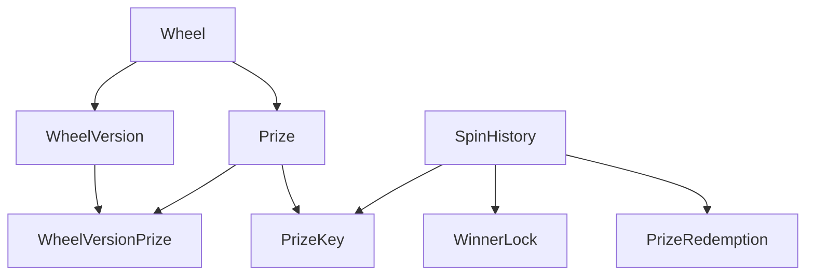
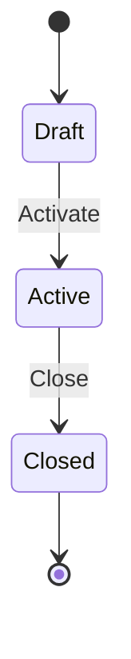
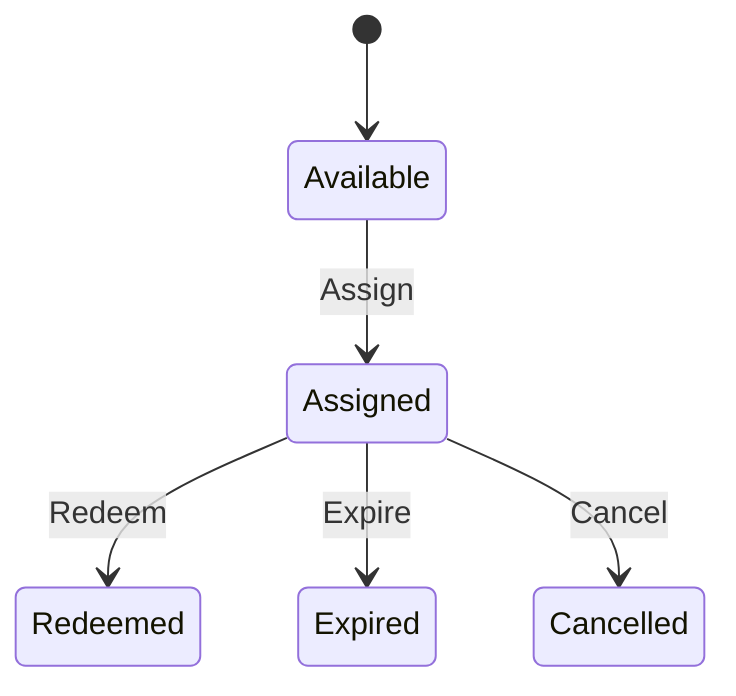

# Giai đoạn 2: Domain Layer

## Tổng quan
- **Mục tiêu Giai đoạn 2:** Xây dựng Domain Layer thuần khiết bao gồm Entity, Enum, Exceptions và các logic nghiệp vụ (business rule/state transition).
- **Phạm vi đã làm:** Thiết lập `Entity`, các business entities (`Wheel`, `Prize`, `PrizeKey`...) và Unit Tests kiểm tra trạng thái chuyển đổi.
- **Phần nằm ngoài phạm vi:** Controller, cấu hình Database (EF Core, Migrations), Authentication, và DTOs.

## Cấu trúc Domain
```text
src/LuckyWheel.Domain/
├── Common/
│   ├── AuditableEntity.cs
│   ├── DomainException.cs
│   └── Entity.cs
├── Entities/
│   ├── AdminUser.cs
│   ├── AuditLog.cs
│   ├── Prize.cs
│   ├── PrizeKey.cs
│   ├── PrizeRedemption.cs
│   ├── SpinHistory.cs
│   ├── Wheel.cs
│   ├── WheelVersion.cs
│   ├── WheelVersionPrize.cs
│   └── WinnerLock.cs
└── Enums/
    ├── AuditAction.cs
    ├── PrizeKeyStatus.cs
    ├── SpinResult.cs
    ├── SpinStatus.cs
    └── WheelVersionStatus.cs

tests/LuckyWheel.UnitTests/
├── Domain/
│   ├── PrizeKeyTests.cs
│   ├── SpinHistoryTests.cs
│   ├── WheelVersionTests.cs
│   └── WinnerLockTests.cs
└── GlobalUsings.cs
```

## Enum

| Enum | Giá trị | Ý nghĩa |
| ---- | ------- | ------- |
| `WheelVersionStatus` | Draft (1), Active (2), Closed (3) | Trạng thái cấu hình version của Wheel |
| `SpinResult` | NoPrize (1), Win (2) | Kết quả quay thưởng |
| `SpinStatus` | Completed (1), Cancelled (2) | Trạng thái Spin |
| `PrizeKeyStatus` | Available (1), Assigned (2), Redeemed (3), Expired (4), Cancelled (5) | Vòng đời của Key |
| `AuditAction` | Created (1) - Blocked (10) | Các hành động Audit |

## Base classes và exception
- **`Entity`**: Base class tự sinh `Guid.NewGuid()` cho `Id`.
- **`AuditableEntity`**: Base class kế thừa `Entity` thêm `CreatedAtUtc` và `UpdatedAtUtc`.
- **`DomainException`**: Exception class chứa `Code` và `Message`.
- **Cách quản lý ID**: Được tự động khởi tạo bằng `Guid.NewGuid()`.
- **Cách quản lý thời gian**: Không sử dụng `DateTime.Now` hay `UtcNow` bên trong Entity, thời gian được truyền từ ngoài qua parameters theo chuẩn `Utc`.
- **Cấu trúc error code**: Chuỗi in hoa nối bằng dấu gạch dưới, VD: `PRIZE_KEY_INVALID_STATUS`.

## Entity

| Entity | Trách nhiệm | Thuộc tính quan trọng | Business methods |
| ------ | ----------- | --------------------- | ---------------- |
| `Wheel` | Thông tin Wheel public | Name, Slug, IsEnabled | `Update()`, `Enable()`, `Disable()` |
| `WheelVersion` | Thông số và thời gian chạy cấu hình | VersionNumber, Status, StartAtUtc, EndAtUtc | `UpdateSchedule()`, `Activate()`, `Close()` |
| `Prize` | Thông tin giải thưởng | TotalQuantity, RequiresKey | `Update()`, `Enable()`, `Disable()` |
| `WheelVersionPrize` | Segment cấu hình tỉ lệ, màu sắc | ProbabilityWeight, DisplayOrder | `UpdateConfiguration()` |
| `PrizeKey` | Mã khóa claim giải | CodeHash, CodeEncrypted, Status | `Assign()`, `Redeem()`, `Expire()`, `Cancel()` |
| `SpinHistory` | Lịch sử lượt quay | Result, Status, EmailNormalized | `CreateNoPrize()`, `CreateWin()`, `Cancel()` |
| `WinnerLock` | Giới hạn 1 email 1 Wheel | IsActive, IsBlocked | `Unlock()`, `Block()` |
| `AdminUser` | Tài khoản Admin | Email, DisplayName, IsActive | `Activate()`, `Deactivate()`, `UpdateDisplayName()` |
| `PrizeRedemption` | Lịch sử claim giải | SpinId, ConfirmedByAdminId | (Immutable, chỉ có Constructor) |
| `AuditLog` | Lưu vết hệ thống | Action, EntityType | (Immutable, chỉ có Constructor) |

## Quan hệ nghiệp vụ



## Vòng đời Wheel Version


- **Điều kiện**: Chỉ `Draft` mới chuyển được thành `Active`. Chỉ `Active` mới được `Close`. Thời gian Activate phải thỏa mãn `EndAtUtc > StartAtUtc`.

## Vòng đời Prize Key



| Trạng thái hiện tại | Method | Trạng thái mới | Điều kiện |
| ------------------- | ------ | -------------- | --------- |
| **Available** | `Assign()` | **Assigned** | `expiresAtUtc > assignedAtUtc` |
| **Assigned** | `Redeem()` | **Redeemed** | `redeemedAtUtc < ExpiresAtUtc` |
| **Assigned** | `Expire()` | **Expired** | `expiredAtUtc >= ExpiresAtUtc` |
| **Assigned** | `Cancel()` | **Cancelled** | Chỉ áp dụng với key đang `Assigned` |

- Key đã hiển thị không quay về `Available`.
- `Redeemed`, `Expired`, `Cancelled` là trạng thái cuối.
- Việc sinh key thay thế chưa thuộc Domain.

## Spin và Winner Lock
- **NO_PRIZE**: Không có `PrizeKey`, không tạo `WinnerLock`, Gmail có thể quay lại.
- **WIN**: Bắt buộc có `Prize` và `PrizeKey`, tạo `WinnerLock`, Gmail không được quay tiếp trong cùng Wheel.

## Validation và error code
- **Guard clause**: Đã triển khai để chặn null/rỗng cho các chuỗi, kiểm tra `Guid.Empty` cho ID.
- **Quy tắc thời gian**: Luôn đảm bảo thời gian kết thúc phải lớn hơn bắt đầu.
- **Quy tắc ID**: Không cho phép rỗng.
- **Quy tắc trạng thái**: Đảm bảo State Pattern chặt chẽ.
- **Các `DomainException.Code` thực tế**: `WHEEL_VERSION_INVALID_PERIOD`, `PRIZE_KEY_CANNOT_BE_REDEEMED`, `SPIN_ALREADY_CANCELLED`...

## Unit test

| Test class | Số test | Nội dung kiểm tra | Kết quả |
| ---------- | ------: | ----------------- | ------- |
| `PrizeKeyTests` | 13 | Vòng đời và exception của PrizeKey | Pass |
| `WheelVersionTests` | 8 | Trạng thái Activate/Close của Version | Pass |
| `WinnerLockTests` | 5 | Trạng thái Block/Unlock | Pass |
| `SpinHistoryTests` | 6 | Factory create và Cancel Spin | Pass |

*(Tổng 32 tests bao gồm các test nhỏ sinh ra từ GD1)*

## Dependency check
`LuckyWheel.Domain`
- Không phụ thuộc EF Core: **Có**
- Không phụ thuộc ASP.NET Core: **Có**
- Không phụ thuộc Infrastructure: **Có**
- Không phụ thuộc Api: **Có**

## Kết quả xác minh
- `dotnet restore`: PASS
- `dotnet build`: PASS (0 Error, 0 Warning)
- `dotnet test`: PASS (33 passed - 32 Unit, 1 Integration)

## Sai khác so với Business Rules
Không phát hiện sai khác nghiệp vụ đáng kể trong phạm vi Giai đoạn 2.

## Phần chuyển sang Giai đoạn 3
- EF Core & `ApplicationDbContext`.
- Entity configurations, Relationships và foreign keys trong database.
- Unique/filtered index.
- Migration và SQL Server.

## Trạng thái và thời gian
Stage: COMPLETED
Verified at: 2026-08-12T06:55:00Z
Next stage: Stage 3 — Database & EF Core
