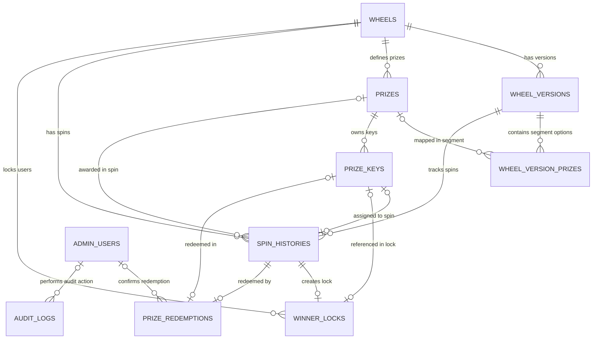

# Giai đoạn 3: Database và Entity Framework Core

## 1. Mục tiêu Giai đoạn 3
- Thiết lập tầng Persistence Layer cho dự án Lucky Wheel sử dụng .NET 8, Entity Framework Core 8.0.11 và SQL Server.
- Cấu hình toàn bộ Domain Entities bằng Fluent API trong `LuckyWheel.Infrastructure`.
- Xây dựng database constraints, unique indexes, filtered indexes, enum string conversions và optimistic concurrency control (`RowVersion`).
- Quản lý database bằng EF Core Migrations (`InitialCreate`) và cập nhật thành công lên SQL Server local (`LuckyWheelDb`).
- Bảo mật thông tin kết nối database bằng .NET User Secrets, tuyệt đối không commit password hay connection string thực lên repository.
- Viết bộ Integration Test kiểm tra tính toàn vẹn của database constraints.

## 2. Phạm vi đã triển khai
- Đã cài đặt các NuGet packages tương thích .NET 8: EF Core, EF Core SqlServer, EF Core Design, EF Core HealthChecks.
- Định nghĩa interface `IApplicationDbContext` trong `LuckyWheel.Application`.
- Cấu hình `ApplicationDbContext` và `DesignTimeDbContextFactory` trong `LuckyWheel.Infrastructure`.
- Cấu hình Fluent API cho 10 Domain Entities (`Wheels`, `WheelVersions`, `Prizes`, `WheelVersionPrizes`, `PrizeKeys`, `SpinHistories`, `WinnerLocks`, `PrizeRedemption`, `AuditLogs`, `AdminUsers`).
- Tạo và áp dụng Migration `InitialCreate` thành công trên SQL Server local.
- Viết 20 Integration Tests kiểm thử các ràng buộc unique, filtered index, check constraint, delete behavior, enum storage, EF metadata và RowVersion concurrency.

## 3. Package đã cài và phiên bản

| Project | Package | Phiên bản |
| ------- | ------- | --------- |
| `LuckyWheel.Application` | `Microsoft.EntityFrameworkCore` | `8.0.11` |
| `LuckyWheel.Infrastructure` | `Microsoft.EntityFrameworkCore` | `8.0.11` |
| `LuckyWheel.Infrastructure` | `Microsoft.EntityFrameworkCore.SqlServer` | `8.0.11` |
| `LuckyWheel.Infrastructure` | `Microsoft.EntityFrameworkCore.Design` | `8.0.11` |
| `LuckyWheel.Infrastructure` | `Microsoft.Extensions.Configuration` | `8.0.0` |
| `LuckyWheel.Infrastructure` | `Microsoft.Extensions.Configuration.Json` | `8.0.0` |
| `LuckyWheel.Infrastructure` | `Microsoft.Extensions.Configuration.UserSecrets` | `8.0.0` |
| `LuckyWheel.Infrastructure` | `Microsoft.Extensions.Configuration.EnvironmentVariables` | `8.0.0` |
| `LuckyWheel.Api` | `Microsoft.EntityFrameworkCore.Design` | `8.0.11` |
| `LuckyWheel.Api` | `Microsoft.Extensions.Diagnostics.HealthChecks.EntityFrameworkCore` | `8.0.11` |
| `LuckyWheel.IntegrationTests` | `Microsoft.EntityFrameworkCore.SqlServer` | `8.0.11` |
| `LuckyWheel.IntegrationTests` | `Microsoft.Extensions.Configuration.UserSecrets` | `8.0.0` |

## 4. Cấu trúc Persistence Layer
```text
src/LuckyWheel.Application/
└── Common/
    └── Interfaces/
        └── IApplicationDbContext.cs

src/LuckyWheel.Infrastructure/
├── DependencyInjection.cs
└── Persistence/
    ├── ApplicationDbContext.cs
    ├── DesignTimeDbContextFactory.cs
    ├── Configurations/
    │   ├── AdminUserConfiguration.cs
    │   ├── AuditLogConfiguration.cs
    │   ├── PrizeConfiguration.cs
    │   ├── PrizeKeyConfiguration.cs
    │   ├── PrizeRedemptionConfiguration.cs
    │   ├── SpinHistoryConfiguration.cs
    │   ├── WheelConfiguration.cs
    │   ├── WheelVersionConfiguration.cs
    │   ├── WheelVersionPrizeConfiguration.cs
    │   └── WinnerLockConfiguration.cs
    └── Migrations/
        ├── 20260812073257_InitialCreate.cs
        ├── 20260812073257_InitialCreate.Designer.cs
        └── ApplicationDbContextModelSnapshot.cs
```

## 5. Đăng ký ApplicationDbContext
Trong `src/LuckyWheel.Infrastructure/DependencyInjection.cs`:
- `ApplicationDbContext` được đăng ký dịch vụ với `AddDbContext<ApplicationDbContext>`.
- Sử dụng SQL Server provider via `UseSqlServer`.
- Đăng ký `EnableRetryOnFailure(maxRetryCount: 5, maxRetryDelay: TimeSpan.FromSeconds(10), errorNumbersToAdd: null)`.
- Áp dụng `AddScoped<IApplicationDbContext>(sp => sp.GetRequiredService<ApplicationDbContext>())`.

## 6. Danh sách DbSet
```csharp
public DbSet<Wheel> Wheels => Set<Wheel>();
public DbSet<WheelVersion> WheelVersions => Set<WheelVersion>();
public DbSet<Prize> Prizes => Set<Prize>();
public DbSet<WheelVersionPrize> WheelVersionPrizes => Set<WheelVersionPrize>();
public DbSet<PrizeKey> PrizeKeys => Set<PrizeKey>();
public DbSet<SpinHistory> SpinHistories => Set<SpinHistory>();
public DbSet<WinnerLock> WinnerLocks => Set<WinnerLock>();
public DbSet<PrizeRedemption> PrizeRedemptions => Set<PrizeRedemption>();
public DbSet<AuditLog> AuditLogs => Set<AuditLog>();
public DbSet<AdminUser> AdminUsers => Set<AdminUser>();
```

## 7. Mapping Entity sang Database Table

| Domain Entity | Database Table | Khóa chính | Note / Audit |
| ------------- | -------------- | ---------- | ------------ |
| `Wheel` | `Wheels` | `Id` (Guid) | Auditable (CreatedAtUtc, UpdatedAtUtc) |
| `WheelVersion` | `WheelVersions` | `Id` (Guid) | Auditable, RowVersion |
| `Prize` | `Prizes` | `Id` (Guid) | Auditable, RowVersion |
| `WheelVersionPrize` | `WheelVersionPrizes` | `Id` (Guid) | Auditable |
| `PrizeKey` | `PrizeKeys` | `Id` (Guid) | Auditable, RowVersion |
| `SpinHistory` | `SpinHistories` | `Id` (Guid) | Immutable Log (CreatedAtUtc) |
| `WinnerLock` | `WinnerLocks` | `Id` (Guid) | Entity, RowVersion |
| `PrizeRedemption` | `PrizeRedemptions` | `Id` (Guid) | Immutable Log |
| `AuditLog` | `AuditLogs` | `Id` (Guid) | Immutable Log |
| `AdminUser` | `AdminUsers` | `Id` (Guid) | Auditable |

## 8. Khóa chính và khóa ngoại (Foreign Keys)

| Bảng nguồn | Cột khóa ngoại | Bảng đích | Referential Action |
| ---------- | -------------- | --------- | ------------------ |
| `WheelVersions` | `WheelId` | `Wheels.Id` | `Restrict` |
| `Prizes` | `WheelId` | `Wheels.Id` | `Restrict` |
| `WheelVersionPrizes` | `WheelVersionId` | `WheelVersions.Id` | `Restrict` |
| `WheelVersionPrizes` | `PrizeId` (nullable) | `Prizes.Id` | `Restrict` |
| `PrizeKeys` | `PrizeId` | `Prizes.Id` | `Restrict` |
| `PrizeKeys` | `AssignedSpinId` (nullable) | `SpinHistories.Id` | `Restrict` |
| `SpinHistories` | `WheelId` | `Wheels.Id` | `Restrict` |
| `SpinHistories` | `WheelVersionId` | `WheelVersions.Id` | `Restrict` |
| `SpinHistories` | `PrizeId` (nullable) | `Prizes.Id` | `Restrict` |
| `SpinHistories` | `PrizeKeyId` (nullable) | `PrizeKeys.Id` | `Restrict` |
| `WinnerLocks` | `WheelId` | `Wheels.Id` | `Restrict` |
| `WinnerLocks` | `SpinId` | `SpinHistories.Id` | `Restrict` |
| `WinnerLocks` | `PrizeKeyId` | `PrizeKeys.Id` | `Restrict` |
| `PrizeRedemptions` | `SpinId` | `SpinHistories.Id` | `Restrict` |
| `PrizeRedemptions` | `PrizeKeyId` | `PrizeKeys.Id` | `Restrict` |
| `PrizeRedemptions` | `ConfirmedByAdminId` | `AdminUsers.Id` | `Restrict` |
| `AuditLogs` | `AdminUserId` (nullable) | `AdminUsers.Id` | `Restrict` |

## 9. Unique Indexes

| Tên Index | Bảng | Các cột | Mục đích nghiệp vụ |
| --------- | ---- | ------- | ------------------ |
| `IX_Wheels_Slug` | `Wheels` | `Slug` | Đảm bảo Slug không trùng lặp |
| `IX_WheelVersions_WheelId_VersionNumber` | `WheelVersions` | `WheelId, VersionNumber` | Mỗi Wheel không có 2 Version cùng số thứ tự |
| `IX_WheelVersionPrizes_WheelVersionId_DisplayOrder` | `WheelVersionPrizes` | `WheelVersionId, DisplayOrder` | Vị trí hiển thị trên vòng quay không trùng |
| `IX_PrizeKeys_CodeHash` | `PrizeKeys` | `CodeHash` | Mã voucher hash không bị lặp lại |
| `IX_SpinHistories_IdempotencyKey` | `SpinHistories` | `IdempotencyKey` | Đảm bảo tính Idempotent của lượt quay |
| `IX_SpinHistories_ReceiptToken` | `SpinHistories` | `ReceiptToken` | Mã biên nhận quay là độc nhất |
| `IX_PrizeRedemptions_SpinId` | `PrizeRedemptions` | `SpinId` | Mỗi lượt quay chỉ được đổi thưởng 1 lần |
| `IX_PrizeRedemptions_PrizeKeyId` | `PrizeRedemptions` | `PrizeKeyId` | Mỗi Prize Key chỉ được đổi thưởng 1 lần |
| `IX_AdminUsers_Email` | `AdminUsers` | `Email` | Email Admin là duy nhất |

## 10. Filtered Unique Indexes

| Tên Index | Bảng | Các cột | Điều kiện Filter (`WHERE`) | Mục đích nghiệp vụ |
| --------- | ---- | ------- | -------------------------- | ------------------ |
| `IX_WheelVersions_WheelId` | `WheelVersions` | `WheelId` | `[Status] = 'Active'` | Mỗi Wheel chỉ có tối đa 1 active version |
| `IX_SpinHistories_PrizeKeyId` | `SpinHistories` | `PrizeKeyId` | `[PrizeKeyId] IS NOT NULL` | Mỗi Prize Key chỉ được liên kết tối đa 1 lượt quay thắng |
| `IX_WinnerLocks_WheelId_EmailNormalized` | `WinnerLocks` | `WheelId, EmailNormalized` | `[IsActive] = 1` | Mỗi email chuẩn hóa chỉ được có tối đa 1 active WinnerLock trong cùng 1 Wheel |

## 11. Check Constraints

| Tên Constraint | Bảng | Bào thức SQL Check |
| -------------- | ---- | ------------------ |
| `CK_WheelVersions_ValidPeriod` | `WheelVersions` | `[EndAtUtc] > [StartAtUtc]` |
| `CK_WheelVersions_ClaimDuration` | `WheelVersions` | `[ClaimDurationMinutes] > 0` |
| `CK_WheelVersions_VersionNumber` | `WheelVersions` | `[VersionNumber] > 0` |
| `CK_Prizes_TotalQuantity` | `Prizes` | `[TotalQuantity] >= 0` |
| `CK_Prizes_KeyRequiresQuantity` | `Prizes` | `[RequiresKey] = 0 OR [TotalQuantity] > 0` |
| `CK_WheelVersionPrizes_ProbabilityWeight` | `WheelVersionPrizes` | `[ProbabilityWeight] >= 0` |
| `CK_WheelVersionPrizes_DisplayOrder` | `WheelVersionPrizes` | `[DisplayOrder] > 0` |
| `CK_WheelVersionPrizes_PrizeReference` | `WheelVersionPrizes` | `([IsNoPrize] = 1 AND [PrizeId] IS NULL) OR ([IsNoPrize] = 0 AND [PrizeId] IS NOT NULL)` |

## 12. Enum Conversion
Toàn bộ Enum trong Domain được lưu dưới dạng chuỗi `nvarchar(30)`:
- `WheelVersionStatus`: `Draft`, `Active`, `Closed`.
- `SpinResult`: `NoPrize`, `Win`.
- `SpinStatus`: `Completed`, `Cancelled`.
- `PrizeKeyStatus`: `Available`, `Assigned`, `Redeemed`, `Expired`, `Cancelled`.
- `AuditAction`: `Created`, `Updated`, `Activated`, `Closed`, `Assigned`, `Redeemed`, `Expired`, `Cancelled`, `Unlocked`, `Blocked`.

## 13. Optimistic Concurrency Control
Cấu hình Shadow Property `RowVersion` kiểu SQL Server `rowversion` (`byte[]`) cho 4 entities có khả năng tranh chấp thao tác cao:
- `WheelVersion`
- `Prize`
- `PrizeKey`
- `WinnerLock`

Cấu hình Fluent API:
```csharp
builder.Property<byte[]>("RowVersion")
    .IsRowVersion()
    .IsConcurrencyToken();
```

## 14. Delete Behavior
Tất cả quan hệ khóa ngoại được cấu hình mặc định là `DeleteBehavior.Restrict`.
Việc xóa một Wheel hoặc Prize sẽ thất bại ở cấp độ database nếu có dữ liệu lịch sử liên kết (WheelVersion, PrizeKey, SpinHistory...), giúp bảo toàn lịch sử giao dịch.

## 15. Quản lý Connection String an toàn
- Trong `appsettings.json` và `appsettings.Development.json`, thông tin `ConnectionStrings:DefaultConnection` chỉ để giá trị rỗng `""`.
- Connection string local được lưu trữ độc lập bằng `.NET User Secrets` cho project `LuckyWheel.Api`:
  ```bash
  dotnet user-secrets init --project src/LuckyWheel.Api
  dotnet user-secrets set "ConnectionStrings:DefaultConnection" "Server=localhost;Database=LuckyWheelDb;User ID=sa;Password=<your-local-password>;TrustServerCertificate=True" --project src/LuckyWheel.Api
  ```
- `DesignTimeDbContextFactory` và Integration Test đọc connection string từ User Secrets và Environment Variables, đảm bảo không có mật khẩu nào bị commit lên repository hay in ra log.

## 16. Sơ đồ ERD



## 17. Migrations đã tạo
- Migration name: `InitialCreate`
- Output directory: `src/LuckyWheel.Infrastructure/Persistence/Migrations`
- Database áp dụng thành công: `LuckyWheelDb` (SQL Server Local).

## 18. Integration Tests
Tạo class `DatabaseConstraintTests` trong `tests/LuckyWheel.IntegrationTests/Persistence/` sử dụng database test riêng `LuckyWheelDb_IntegrationTests`:
1. `Can_Create_Wheel`: Thêm mới Wheel thành công.
2. `Cannot_Create_Two_Wheels_With_Same_Slug`: Kiểm tra Unique Slug.
3. `Can_Create_WheelVersion_With_Valid_ForeignKey`: Tạo Version kết nối đúng WheelId.
4. `Cannot_Create_Two_WheelVersions_With_Same_VersionNumber`: Kiểm tra Unique `(WheelId, VersionNumber)`.
5. `Cannot_Exist_Two_Active_Versions_For_Same_Wheel`: Kiểm tra Filtered Unique Index cho Active version.
6. `Cannot_Create_Two_PrizeKeys_With_Same_CodeHash`: Kiểm tra Unique CodeHash cho PrizeKey.
7. `Cannot_Create_Two_Active_WinnerLocks_For_Same_Email`: Kiểm tra Filtered Unique Index WinnerLock active.
8. `Can_Create_Multiple_Historical_Inactive_WinnerLocks_For_Same_Email`: Kiểm tra lưu lịch sử WinnerLock đã unlock.
9. `Cannot_Assign_Same_PrizeKey_To_Two_Spins`: Kiểm tra Unique Filtered Index `PrizeKeyId` trong SpinHistories.
10. `Cannot_Create_Two_Redemptions_For_Same_PrizeKey`: Kiểm tra Unique PrizeKeyId trong PrizeRedemptions.
11. `DeleteBehavior_Does_Not_Cascade_Delete_Historical_Data`: Xác minh `Restrict` ngăn xóa cascade dữ liệu cha.
12. `Enums_Are_Saved_As_Strings_In_Database`: Xác minh Enum được lưu bằng tên dạng chuỗi trong database.
13. `RowVersion_Changes_On_Entity_Update`: Kiểm tra giá trị `RowVersion` tự động thay đổi khi update entity.
14. `Api_Assembly_Should_Be_Loadable`: Test kiểm tra load assembly.

## 19. Kết quả khôi phục, biên dịch và kiểm thử
- `dotnet restore`: PASS
- `dotnet build`: PASS (0 Error, 0 Warning)
- `dotnet test`: PASS (52/52 passed — 32 Unit Tests, 20 Integration Tests)
- Endpoint `/health`, `/api/system/info`, `/swagger`: PASS (HTTP 200).

## 23. Trạng thái giai đoạn
`COMPLETED`

## 24. Thời gian xác minh
- UTC Time: `2026-08-12T08:03:00Z`

## 25. Giai đoạn tiếp theo
- Giai đoạn 4 — Shared Components.

## Verification sau triển khai

- Ngày kiểm tra UTC: `2026-08-12`
- Người/agent kiểm tra: `Codex — Senior .NET Backend Reviewer / Database QA`
- .NET SDK: `8.0.420` đã cài đặt; CLI mặc định của máy là `10.0.301`; project target `net8.0`.
- EF Core: `8.0.11`; `dotnet-ef 8.0.11`.
- SQL Server target: chỉ xác nhận tên `LuckyWheelDb_IntegrationTests`; không ghi connection string/secret.
- Migration: `InitialCreate` PASS từ database trống; migration SQL đã review, không có lệnh tạo/xóa database.
- Build: PASS, 0 warning, 0 error.
- Unit tests: 32 passed, 0 failed, 0 skipped.
- Integration tests: 20 passed, 0 failed, 0 skipped; dùng SQL Server thật, không dùng EF InMemory.
- Constraint tests: PASS cho FK, unique/filtered index, check constraint, Restrict/NoAction, enum string và optimistic concurrency.
- Secret scan: PASS trên file được Git theo dõi; không phát hiện credential/connection string thật.
- Health check: PASS; `/health`, `/api/system/info`, `/swagger` đều HTTP 200.
- Kết luận: persistence/migration PASS; trạng thái tổng thể `IN_PROGRESS` do Application Layer còn phụ thuộc EF Core ngoài phạm vi được phép sửa.

| Mức độ | Vấn đề | File liên quan | Cách xử lý | Trạng thái |
| --- | --- | --- | --- | --- |
| Critical | Fixture có thể xóa nhầm DB do thay chuỗi connection string và dùng `EnsureDeleted()` | `TestDatabaseFixture.cs` | Parse connection string, whitelist tên DB, cưỡng bức DB integration, bỏ xóa tự động và dùng `Migrate()` | Đã sửa |
| High | Shadow `RowVersion` sinh nullable | 4 EF configuration và `InitialCreate` | Thêm `IsRequired()`, tái tạo migration chưa tracked, test concurrency hai DbContext | Đã sửa |
| High | Application Layer tham chiếu EF Core | `LuckyWheel.Application.csproj`, `IApplicationDbContext.cs` | Cần tái thiết abstraction ngoài phạm vi file được phép của review này | Chưa sửa |
| Medium | Constraint/metadata test chưa đủ | `DatabaseConstraintTests.cs`, `EfModelMetadataTests.cs` | Bổ sung FK, display order, idempotency, check constraint, metadata và concurrency tests | Đã sửa |
