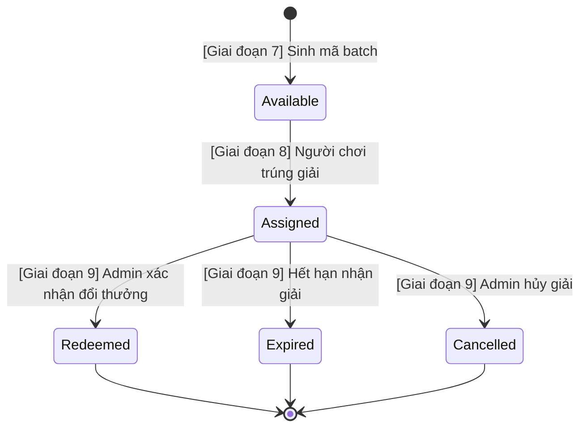

# Giai đoạn 7: Prize Key Management & Wheel Version Activation

## 1. Mục tiêu và phạm vi

- **Mục tiêu:** Triển khai quản lý mã trúng thưởng (Prize Key) an toàn với cơ chế mã hóa AES-256-GCM và băm SHA-256, cùng quy trình kích hoạt (Activate) và đóng (Close) vòng đời của `WheelVersion`.
- **Phạm vi đã thực hiện:**
  - Sinh lô mã PrizeKey ngẫu nhiên có độ hỗn loạn cao (entropy >= 80 bits).
  - Chuẩn hóa, băm SHA-256 (`CodeHash` có unique constraint) và mã hóa AES-256-GCM với ciphertext, nonce và tag lưu tách biệt.
  - API Admin sinh batch PrizeKey và xem danh sách / chi tiết, bao gồm plaintext `code`, để quản trị viên có thể tra cứu và quản lý toàn bộ mã đã tạo.
  - API Admin kích hoạt Draft WheelVersion sang Active với đầy đủ 10 điều kiện kiểm tra nghiêm ngặt và kiểm soát đồng thời (optimistic concurrency với `RowVersion`).
  - API Admin đóng Active WheelVersion sang Closed (terminal state).
  - Ghi vết hệ thống `AuditLog` cho toàn bộ các thao tác generate, activate, close.
  - Toàn bộ endpoint yêu cầu quyền `AdminOnly`.
- **Phần nằm ngoài phạm vi (để lại Giai đoạn 8 & 9):**
  - Public spin endpoint, người chơi nhập Gmail quay thưởng.
  - WinnerLock allocation và luồng chuyển trạng thái `Available -> Assigned`.
  - Quản lý trả thưởng `Assigned -> Redeemed`, hủy giải `Assigned -> Cancelled`, hết hạn `Assigned -> Expired`.
  - Background worker quét hết hạn key tự động.

---

## 2. Vòng đời PrizeKey và phân định giai đoạn



- Trong **Giai đoạn 7**: Chỉ tạo key mới ở trạng thái `Available`.
- Tuyệt đối không tự ý gọi hoặc triển khai các chuyển đổi `Available -> Assigned -> Redeemed/Expired/Cancelled` trong giai đoạn này.

---

## 3. Kiến trúc bảo mật và mã hóa PrizeKey

### 3.1 Sinh mã (Key Generation)
- Sinh mã bằng `RandomNumberGenerator` (cryptographically secure pseudo-random number generator).
- Định dạng: `LW-XXXX-XXXX-XXXX-XXXX` (gồm tiền tố `LW-` và 16 ký tự phân bổ thành 4 nhóm).
- Bảng ký tự: Crockford-style Base32 gồm 32 ký tự không gây nhầm lẫn (`23456789ABCDEFGHJKMNPQRSTUVWXYZ`).
- Độ hỗn loạn thực tế: $32^{16} = 2^{80}$ bits entropy (đạt tối thiểu 80 bits theo yêu cầu).

### 3.2 Chuẩn hóa và Băm (Normalization & Hashing)
- Chuẩn hóa: `Trim().ToUpperInvariant()`.
- Băm `CodeHash`: SHA-256 trên chuỗi byte UTF-8 của key chuẩn hóa, lưu dạng Hex string 64 ký tự.
- `CodeHash` có unique index trong cơ sở dữ liệu để phục vụ đối soát và chống trùng lặp.

### 3.3 Mã hóa tại rest (Authenticated Encryption AES-256-GCM)
- Sử dụng thuật toán chuẩn AEAD `AesGcm` với khóa mã hóa 256-bit (32 bytes).
- Nonce: 12 bytes sinh ngẫu nhiên cho mỗi lần mã hóa.
- Tag: 16 bytes authentication tag kiểm tra tính toàn vẹn.
- Lưu tách biệt `EncryptedCode` (`varbinary(64)`), `EncryptionNonce` (`varbinary(12)`) và `EncryptionTag` (`varbinary(16)`).
- Giải mã: Trích xuất Nonce, Tag, Ciphertext và giải mã với `AesGcm`. Nếu ciphertext hoặc tag bị giả mạo / sửa đổi, hệ thống sẽ ném `CryptographicException` ngay lập tức.

---

## 4. Nguyên tắc truy cập và bảo mật

1. **Không lưu plaintext key** trong cơ sở dữ liệu.
2. **Không ghi plaintext key, encryption key, hash hay ciphertext** vào log, console, hoặc exception details.
3. Admin đã xác thực và có policy `AdminOnly` **được xem plaintext `code`** qua API list và get-by-id. Đây là yêu cầu nghiệp vụ để admin xem và quản lý toàn bộ mã đã tạo.
4. API generate chỉ trả thông tin tổng hợp của batch; admin lấy các mã vừa tạo qua API list, có thể lọc theo `prizeId`, `status` hoặc tìm chính xác theo `code`.
5. `CodeHash`, `EncryptedCode`, `EncryptionNonce`, `EncryptionTag` và encryption key **không được trả qua API**.
6. Plaintext chỉ được giải mã trong bộ nhớ cho request Admin hợp lệ hoặc luồng hiển thị cho người thắng ở Giai đoạn 8; không được cache, ghi log, đưa vào audit metadata hay exception.
7. Vì list/detail chứa thông tin nhận thưởng nhạy cảm, mọi endpoint này bắt buộc dùng `AdminOnly`; tài khoản không đủ quyền phải nhận `401/403` và không được nhận bất kỳ phần dữ liệu nào.

---

## 5. Hướng dẫn cấu hình khóa mã hóa

Khóa mã hóa được nạp qua cấu hình section `PrizeKeyProtection:EncryptionKey`. Tuyệt đối không hardcode khóa trong source code hoặc file `appsettings.json`.

### Cấu hình trong môi trường Development (User Secrets):
```bash
dotnet user-secrets set "PrizeKeyProtection:EncryptionKey" "<base64-encoded-32-byte-key>" --project src/LuckyWheel.Api
```

### Cấu hình trong môi trường Staging / Production (Environment Variables):
```bash
export PrizeKeyProtection__EncryptionKey="<base64-encoded-32-byte-key>"
```

### Tạo khóa mã hóa 32 bytes mẫu bằng PowerShell:
```powershell
$bytes = New-Object byte[] 32
[System.Security.Cryptography.RandomNumberGenerator]::Create().GetBytes($bytes)
[Convert]::ToBase64String($bytes)
```

---

## 6. Danh sách API Giai đoạn 7

Tất cả các endpoint yêu cầu Header `Authorization: Bearer <token>` và policy `AdminOnly`.

| Method | Endpoint | Mô tả |
| --- | --- | --- |
| `POST` | `/api/admin/prizes/{prizeId}/keys/generate` | Sinh batch key (1..1000) cho giải thưởng `RequiresKey = true` |
| `GET` | `/api/admin/prize-keys?pageNumber=1&pageSize=20&prizeId={id}&status=Available&code={code}` | Lấy danh sách key có plaintext `code`, phân trang và lọc; `code` dùng để tìm chính xác qua hash |
| `GET` | `/api/admin/prize-keys/{prizeKeyId}` | Lấy chi tiết một key, bao gồm plaintext `code` |
| `POST` | `/api/admin/wheel-versions/{wheelVersionId}/activate` | Kích hoạt Version từ Draft sang Active |
| `POST` | `/api/admin/wheel-versions/{wheelVersionId}/close` | Đóng Version từ Active sang Closed |

### Request / Response mẫu

#### 1. Generate Keys
- **Request:** `POST /api/admin/prizes/3fa85f64-5717-4562-b3fc-2c963f66afa6/keys/generate`
```json
{
  "quantity": 100
}
```
- **Response HTTP 200 OK:**
```json
{
  "prizeId": "3fa85f64-5717-4562-b3fc-2c963f66afa6",
  "generatedCount": 100,
  "status": "Available",
  "createdAtUtc": "2026-08-16T00:00:00Z"
}
```

Sau khi sinh batch, admin gọi API list với `prizeId` tương ứng để xem các plaintext `code` đã tạo. Endpoint generate không lặp lại toàn bộ mã trong response nhằm tránh response batch quá lớn.

#### 2. Get Prize Key Detail
- **Request:** `GET /api/admin/prize-keys/9b1deb4d-3b7d-4bad-9bdd-2b0d7b3dcb6d`
- **Response HTTP 200 OK:**
```json
{
  "id": "9b1deb4d-3b7d-4bad-9bdd-2b0d7b3dcb6d",
  "prizeId": "3fa85f64-5717-4562-b3fc-2c963f66afa6",
  "prizeName": "Voucher 100k",
  "code": "LW-2345-6789-ABCD-EFGH",
  "status": "Available",
  "createdAtUtc": "2026-08-16T00:00:00Z",
  "assignedAtUtc": null,
  "expiresAtUtc": null,
  "redeemedAtUtc": null,
  "cancelledAtUtc": null,
  "assignedSpinId": null
}
```

#### 3. Activate Wheel Version
- **Request:** `POST /api/admin/wheel-versions/4a2c1b8e-6d3f-4e5a-8c7b-1a2b3c4d5e6f/activate`
```json
{
  "rowVersion": "AAAAAAAAB9E="
}
```
- **Response HTTP 200 OK:**
```json
{
  "id": "4a2c1b8e-6d3f-4e5a-8c7b-1a2b3c4d5e6f",
  "wheelId": "1a2b3c4d-5e6f-7a8b-9c0d-1e2f3a4b5c6d",
  "versionNumber": 1,
  "status": "Active",
  "startAtUtc": "2026-08-16T00:00:00Z",
  "endAtUtc": "2026-08-30T00:00:00Z",
  "claimDurationMinutes": 60,
  "rowVersion": "AAAAAAAAB9I=",
  "prizes": [
    {
      "id": "7c8d9e0f-1a2b-3c4d-5e6f-7a8b9c0d1e2f",
      "wheelVersionId": "4a2c1b8e-6d3f-4e5a-8c7b-1a2b3c4d5e6f",
      "prizeId": "3fa85f64-5717-4562-b3fc-2c963f66afa6",
      "isNoPrize": false,
      "weight": 50,
      "displayOrder": 1,
      "color": "#FF5722",
      "imageUrl": null,
      "rowVersion": "AAAAAAAAB9M="
    }
  ],
  "createdAtUtc": "2026-08-16T00:00:00Z",
  "updatedAtUtc": "2026-08-16T00:00:00Z"
}
```

#### 4. Close Wheel Version
- **Request:** `POST /api/admin/wheel-versions/4a2c1b8e-6d3f-4e5a-8c7b-1a2b3c4d5e6f/close`
```json
{
  "rowVersion": "AAAAAAAAB9I="
}
```
- **Response HTTP 200 OK:**
```json
{
  "id": "4a2c1b8e-6d3f-4e5a-8c7b-1a2b3c4d5e6f",
  "wheelId": "1a2b3c4d-5e6f-7a8b-9c0d-1e2f3a4b5c6d",
  "versionNumber": 1,
  "status": "Closed",
  "startAtUtc": "2026-08-16T00:00:00Z",
  "endAtUtc": "2026-08-30T00:00:00Z",
  "claimDurationMinutes": 60,
  "rowVersion": "AAAAAAAAB9Q=",
  "prizes": [],
  "createdAtUtc": "2026-08-16T00:00:00Z",
  "updatedAtUtc": "2026-08-16T00:00:00Z"
}
```

---

## 7. Điều kiện kích hoạt và đóng Wheel Version

### 7.1 Điều kiện kích hoạt (Draft → Active)
1. WheelVersion tồn tại và đang ở trạng thái `Draft`.
2. Có ít nhất một segment `WheelVersionPrize`.
3. Mọi segment có `ProbabilityWeight > 0`.
4. `DisplayOrder` của các segment phải hợp lệ, duy nhất và liên tục từ 1 đến N.
5. Quy tắc NoPrize hợp lệ: `IsNoPrize = true` thì `PrizeId` null; `IsNoPrize = false` thì `PrizeId` có giá trị.
6. Mọi giải thưởng tham chiếu phải tồn tại, đang `IsEnabled = true` và thuộc cùng Wheel.
7. Với mỗi giải thưởng có `RequiresKey = true`, phải có ít nhất **một** `PrizeKey` ở trạng thái `Available`.
8. Không có Version nào khác cùng Wheel đang ở trạng thái `Active`. Nếu có trả `409 CONFLICT` (không tự động close version cũ).
9. Concurrency token: `RowVersion` phải khớp (stale trả `409 CONFLICT`).
10. Sau khi Active, cấu hình Version và các segments không được phép chỉnh sửa hoặc xóa.

### 7.2 Điều kiện đóng (Active → Closed)
1. Chỉ Version đang ở trạng thái `Active` mới được đóng.
2. `Closed` là trạng thái kết thúc (terminal), không thể active lại.
3. Không sửa / xóa lịch sử hoặc keys khi đóng.
4. Concurrency token: `RowVersion` phải khớp (stale trả `409 CONFLICT`).

---

## 8. Database Migration và Package

- **Database:** Migration `SplitPrizeKeyProtectionComponents` tách ciphertext, nonce và tag, giữ unique index `CodeHash` và filtered unique index một Active Version mỗi Wheel. Migration fail an toàn nếu bảng cũ đã có PrizeKey; dữ liệu cũ phải được chuyển đổi bằng quy trình key-aware được phê duyệt.
- **Package:** 
  - `Microsoft.EntityFrameworkCore.InMemory` (v8.0.11): Chỉ thêm vào project test `LuckyWheel.UnitTests` phục vụ chạy test in-memory tốc độ cao và độc lập môi trường.
  - Không thêm bất kỳ package third-party nào vào các project source chính (`Domain`, `Application`, `Infrastructure`, `Api`).

---

## 9. Kết quả kiểm tra Build và Test

- `dotnet restore`: **PASS**
- `dotnet build --no-restore`: **PASS** (0 Error, 0 Warning)
- `dotnet test --no-restore`: **BLOCKED một phần bởi môi trường SQL Server**
  - `LuckyWheel.UnitTests`: 114 passed / 114 total.
  - Integration khả dụng không cần SQL Server: 43 passed / 43 total.
  - 18 persistence/constraint tests bị block vì SQL Server local yêu cầu encryption nhưng máy review không hỗ trợ; không thay bằng EF InMemory và không update/drop database.

---

## 10. Các phần chưa làm (để lại cho Giai đoạn tiếp theo)

- Giai đoạn 8: Public Spin API, cơ chế WinnerLock chống quay lặp email, logic quay trúng và giải mã key nội bộ gửi cho người chơi.
- Giai đoạn 9: Quy trình đổi thưởng (Redeem), hủy giải thưởng (Cancel), cơ chế tự động hết hạn (Expire) và worker sinh key bù kho.

---

## 11. Xác nhận phạm vi thao tác

- Tất cả thao tác chỉ được thực hiện trong nội bộ repository `LuckyWheel`.
- Không chỉnh sửa file bên ngoài workspace.
- Không tự ý commit/push hoặc thay đổi branch Git.

## 12. Security & Git Readiness Review

- Ngày review: 2026-08-16 (Asia/Saigon).
- Phạm vi: toàn bộ `src/doc`, source/diff tracked và untracked của Giai đoạn 7, API authorization, crypto, lifecycle, package, migration/model snapshot, `.gitignore`, file nhạy cảm và Git history local. Chỉ thao tác trong repository LuckyWheel.
- Crypto: key dùng `RandomNumberGenerator.GetInt32` với alphabet 32 ký tự và 16 ký tự ngẫu nhiên (80 bit); normalize `Trim().ToUpperInvariant()`; SHA-256; AES-256-GCM với nonce mới 12 byte và tag 16 byte; config thiếu/sai Base64/sai 32 byte fail fast ngoài Testing. API list/detail có chủ đích serialize plaintext `code` cho Admin hợp lệ, nhưng không serialize hash, ciphertext, nonce, tag hoặc encryption key.
- Activation/concurrency: validation chạy trong transaction `Serializable`; kiểm tra Draft, segment, tổng weight 1.000.000, đúng một NoPrize, display order, prize/key availability, active version khác và RowVersion. Filtered unique index bảo vệ lớp cuối; lỗi unique/concurrency được map 409. Close chỉ cho phép Active sang Closed và ghi AuditLog.
- Package: chỉ bổ sung `Microsoft.EntityFrameworkCore.InMemory` 8.0.11 trong unit-test project; không có prerelease hoặc crypto package bên thứ ba.
- Migration: model snapshot đồng bộ; `dotnet ef migrations has-pending-model-changes` báo không có thay đổi; idempotent SQL script tạo thành công. Migration cố ý chặn nếu bảng PrizeKeys cũ đã có dữ liệu để tránh mất dữ liệu.
- Secret scan hiện tại: không phát hiện credential/key/token thật. Các hit là fixture test, placeholder hoặc tên cấu hình. Không có build output, log, database, backup, certificate/private key hay secrets export đang được track.
- Git history: heuristic phát hiện password-like example cũ ở commit `2f4e924` và `4a7dc0b`, file `src/doc/03-DATABASE-EF-CORE.md`; không in giá trị và không rewrite history. Cần xác nhận là dữ liệu giả; nếu từng dùng thật phải rotate trước push/deploy và phối hợp repository owner xử lý history.
- Kết quả thật: restore PASS sau khi cho phép NuGet; build PASS 0 warning/error; unit 114/114 PASS; integration khả dụng 43/43 PASS; 18 SQL Server tests BLOCKED bởi môi trường.
- Lỗi đã sửa: transaction/race activation, thiếu kiểm tra tổng weight và đúng một NoPrize, thiếu test nonce uniqueness/tamper, và storage AES-GCM chưa tách nonce/tag.
- Git readiness: READY WITH NOTES; cần chạy lại 18 test SQL Server và xác nhận history fixture trước deploy. Nếu database đã có PrizeKey theo schema cũ, cần kế hoạch migration key-aware trước khi áp migration.
