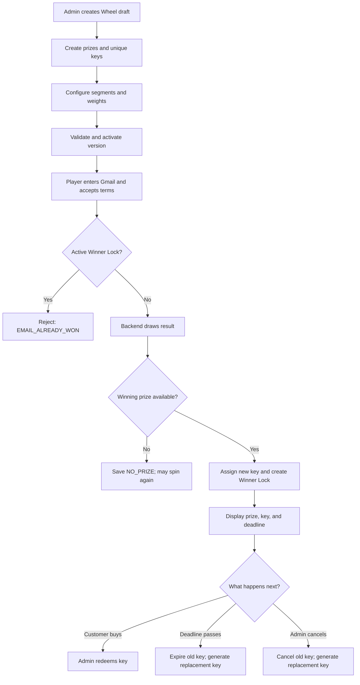
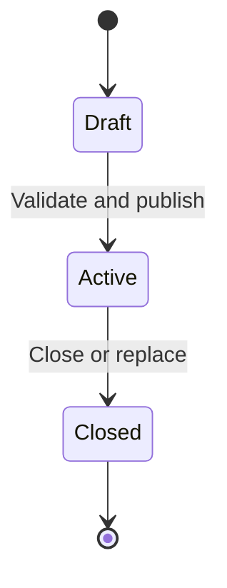
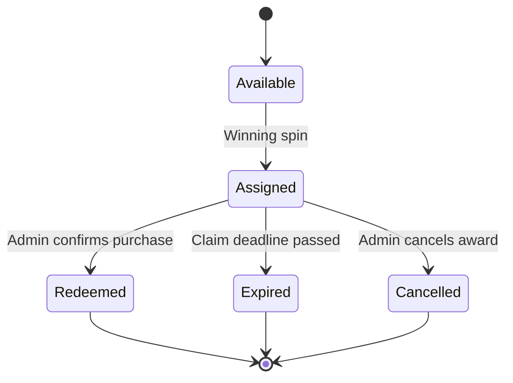

# Lucky Wheel — Business Rules & System Flow

> **Business source of truth for developers and AI coding agents**  
> Version: 1.0  
> Backend target: .NET 8, ASP.NET Core Web API, SQL Server  
> Architecture: Modular Monolith + Clean Architecture + Vertical Slice

## 0. Instructions for AI coding agents

Before creating, reviewing, or changing code:

1. Read this document completely.
2. Treat its business rules as authoritative.
3. Do not silently invent missing business behavior.
4. If a task conflicts with this document, report the conflict before changing code.
5. Preserve historical records. Never rewrite old spin results to represent a new outcome.
6. Enforce critical invariants in both application logic and database constraints where possible.
7. All draw results must be decided by the backend. The frontend only animates the result returned by the backend.

Terms used in this document:

- **Wheel**: one lucky-wheel campaign/program.
- **Wheel Version**: an immutable published configuration of a Wheel.
- **Prize**: a reward definition, such as a discount voucher.
- **Prize slot**: one claimable unit of a Prize.
- **Prize Key**: a unique claim code assigned to exactly one winning spin.
- **Spin**: one draw attempt made with an email address.
- **Winner Lock**: prevents an email that has won from spinning again in the same Wheel.
- **Redeem**: admin confirms that the customer purchased/claimed the prize.

---

## 1. System purpose

The system provides:

- A public lucky-wheel page requiring a Gmail address and acceptance of campaign terms.
- Backend-controlled weighted prize selection.
- A unique key displayed when a user wins a keyed prize.
- Unlimited or policy-limited retries after `NO_PRIZE`, until the email wins.
- At most one winning key for one normalized Gmail address in one Wheel at a time.
- An admin portal/API to configure Wheels, versions, prizes, probability weights, and keys.
- Spin history showing which Gmail won which prize and key.
- Admin redemption, cancellation, blocking, and manual unlocking.
- Automatic expiration of unclaimed keys.
- Permanent audit history.

The public player does **not** create an account or log in. Admin users authenticate separately.

---

## 2. Actors and permissions

| Actor | Allowed actions |
| --- | --- |
| Public player | Read active Wheel, accept terms, enter Gmail, spin, see result and key |
| Admin | Create/manage Wheel drafts, prizes and keys, activate/close versions, search history, redeem/cancel prizes, unlock/block email, view audit log |
| System worker | Expire overdue assigned keys, replenish prize slots with new keys, write system audit logs |

Public players cannot:

- Choose or influence the winning result from the frontend.
- Query another player's result.
- See probability weights, stock, unused keys, or admin data.
- Reuse a request to create additional results.

---

## 3. Core business invariants

These rules must always remain true:

1. A spin result is determined only by the backend.
2. A Prize Key is globally unique.
3. A Prize Key can be assigned to at most one Spin during its lifetime.
4. A key that has been shown to a player is never returned to `AVAILABLE`.
5. `REDEEMED`, `EXPIRED`, and `CANCELLED` keys are terminal and never reused.
6. Replenishing stock means generating a **new key**, not recycling the old key.
7. A winning Spin must reference exactly one Prize and, for a keyed prize, exactly one Prize Key.
8. A `NO_PRIZE` Spin references no Prize Key and creates no Winner Lock.
9. One normalized Gmail can have at most one active Winner Lock per Wheel.
10. A Gmail with an active Winner Lock cannot spin again in that Wheel.
11. Winner locking is scoped to `Wheel`, not `WheelVersion` and not the whole system.
12. Changing to a new version of the same Wheel does not automatically let previous winners spin again.
13. A Gmail may have multiple `NO_PRIZE` Spin histories before winning.
14. Old Spin histories are immutable evidence and must not be deleted or rewritten.
15. Assigning a key, saving the winning Spin, and creating Winner Lock must succeed or fail atomically in one database transaction.
16. Redeem, cancel, and expire operations must be atomic and idempotent.
17. At most one version of a Wheel is `ACTIVE` at a time.
18. An `ACTIVE` or `CLOSED` version is immutable. Configuration changes require a new version.
19. When a selected prize cannot provide an available slot/key, the result becomes `NO_PRIZE`; its probability is not redistributed to another valuable prize.
20. All persisted timestamps use UTC.

---

## 4. High-level system flow



---

## 5. Wheel and version lifecycle

### 5.1 Wheel

A Wheel represents one campaign. Example: `Grand Opening Lucky Wheel`.

It owns:

- General public information.
- Terms and instructions.
- Prizes.
- Multiple configuration versions.
- Spin history and Winner Locks scoped to that Wheel.

Disabling a Wheel prevents public spinning but does not delete history.

### 5.2 Wheel Version states



| State | Meaning | Editable? |
| --- | --- | --- |
| `DRAFT` | Admin is configuring the version | Yes |
| `ACTIVE` | Public users can spin using this configuration | No |
| `CLOSED` | Version is historical and no longer used for new spins | No |

Activation validation must include:

- Valid start and end time.
- Positive claim duration.
- Total probability weight equals `1_000_000`.
- Exactly one `NO_PRIZE` segment.
- Unique display order inside the version.
- Every valuable segment references a valid enabled Prize.
- Every keyed Prize has an available prize slot/key.
- No other active version exists for the Wheel after activation completes.

Activating a replacement version closes the previous active version in the same transaction.

---

## 6. Prize, prize slot, and key model

### 6.1 Prize

A Prize describes what the player can win, for example:

- Voucher 500,000 VND.
- Voucher 100,000 VND.
- Free shipping.

A `NO_PRIZE` segment is a wheel option, not a claimable keyed reward.

### 6.2 Prize slot versus Prize Key

These concepts are different:

| Concept | Meaning |
| --- | --- |
| Prize slot | One available opportunity for a customer to claim a Prize |
| Prize Key | A unique verification code assigned to one specific winning Spin |

When a user wins:

- One Prize slot is temporarily reserved.
- One `AVAILABLE` key becomes `ASSIGNED`.

When the customer redeems:

- The reserved slot becomes consumed permanently.
- The key becomes `REDEEMED`.

When the assignment expires or is cancelled:

- The old key becomes terminal (`EXPIRED` or `CANCELLED`).
- The Prize slot is returned to availability.
- The system generates a different, brand-new `AVAILABLE` key for that returned slot.

### 6.3 Key security

The system must not persist plaintext keys as the sole representation.

Recommended storage:

- `CodeHash`: deterministic HMAC/hash for exact lookup and uniqueness.
- `CodeEncrypted`: encrypted value for authorized display.

Never write a complete key into application logs or audit descriptions.

---

## 7. Prize Key lifecycle



| Status | Meaning | Can be reassigned? |
| --- | --- | --- |
| `AVAILABLE` | Never shown or assigned | Yes, once |
| `ASSIGNED` | Assigned to one winning Spin, awaiting purchase | No |
| `REDEEMED` | Customer purchased/claimed; admin confirmed | Never |
| `EXPIRED` | Claim deadline passed before redemption | Never |
| `CANCELLED` | Admin cancelled the award | Never |

Allowed transitions only:

```text
AVAILABLE -> ASSIGNED
ASSIGNED  -> REDEEMED
ASSIGNED  -> EXPIRED
ASSIGNED  -> CANCELLED
```

No reverse transitions are allowed.

---

## 8. Email identity and normalization

The original input and normalized identity must both be stored:

- `EmailOriginal`: value for admin display and historical evidence.
- `EmailNormalized`: value used for eligibility and Winner Lock checks.

Normalization for Gmail:

1. Trim whitespace.
2. Convert to lowercase.
3. Validate the email and require the accepted domain policy (initially `gmail.com`).
4. Remove the `+tag` portion from the local part.
5. Remove dots from the Gmail local part.

Example:

```text
Quang.Dev+campaign@gmail.com
quangdev@gmail.com
```

Both normalize to:

```text
quangdev@gmail.com
```

Eligibility checks always use `EmailNormalized`.

Important: without email OTP, the system does not prove ownership of the Gmail address. The Prize Key is the primary claim credential; Gmail is supporting verification data.

---

## 9. Public spin flow

### 9.1 Request

```json
{
  "email": "user@gmail.com",
  "acceptedTerms": true,
  "idempotencyKey": "b84e278d-65fb-4225-a22c-2813781ae66f"
}
```

### 9.2 Validation order

1. Request structure is valid.
2. Terms were accepted.
3. Email is valid and normalized.
4. Wheel is enabled.
5. A version is currently active and inside its allowed time window.
6. No active Winner Lock exists for `(WheelId, EmailNormalized)`.
7. Cooldown/rate-limit policy is satisfied.
8. `IdempotencyKey` is checked.

### 9.3 Idempotency behavior

`IdempotencyKey` identifies one logical spin request.

- The same key and same logical request must return the original stored result.
- It must never create a second Spin or allocate another Prize Key.
- Reuse with conflicting request data should return an idempotency conflict.

### 9.4 Draw algorithm

- Use backend cryptographically strong random generation.
- Use integer weights with a configured total of `1_000_000`.
- Select from the immutable active version snapshot.
- Do not let frontend input specify a segment, prize, random number, or outcome.

### 9.5 `NO_PRIZE` outcome

```text
Spin.Result = NO_PRIZE
Spin.Status = COMPLETED
PrizeId = null (or the designated non-prize segment reference)
PrizeKeyId = null
WinnerLock = not created
```

Effects:

- Spin history is saved.
- The same Gmail may spin again subject to cooldown/rate limits.
- There can be many `NO_PRIZE` histories for one Gmail.

### 9.6 `WIN` outcome

Inside one database transaction:

1. Recheck Winner Lock.
2. Reserve one available key/slot atomically.
3. Create winning Spin history.
4. Assign the key to the Spin.
5. Set `AssignedAtUtc` and `ExpiresAtUtc`.
6. Create active Winner Lock.
7. Commit.

Result:

```text
Spin.Result = WIN
Spin.Status = COMPLETED
PrizeId = selected prize
PrizeKeyId = assigned key
PrizeKey.Status = ASSIGNED
WinnerLock.IsActive = true
```

The response contains:

- Spin receipt/token.
- Segment ID for animation.
- Prize name and display data.
- Decrypted Prize Key.
- Claim deadline.
- Claim instructions.

After winning, the normalized Gmail cannot spin again in that Wheel while its Winner Lock remains active.

### 9.7 Selected prize out of stock

If the draw selects a Prize but no slot/key can be allocated atomically:

- Do not select another valuable Prize.
- Save/return `NO_PRIZE` according to the finalized Spin Engine implementation.
- Do not create Winner Lock.
- Record enough internal diagnostics without exposing stock details publicly.

---

## 10. Winner Lock rules

Winner Lock answers one question:

> May this normalized Gmail spin again in this Wheel?

| Lock condition | Can spin? |
| --- | --- |
| No active lock | Yes |
| Active, not blocked | No — already won |
| Active and blocked | No — admin/security block |
| Inactive/unlocked | Yes |

Default behavior after key status changes:

| Key outcome | Winner Lock default |
| --- | --- |
| `REDEEMED` | Remains active |
| `EXPIRED` | Remains active |
| `CANCELLED`, `allowSpinAgain = true` | Becomes inactive |
| `CANCELLED`, `allowSpinAgain = false` | Remains active and blocked |

Expiration never automatically grants another spin. Admin must explicitly unlock when desired.

---

## 11. Admin redemption flow

Customer provides the key and supporting Gmail/prize information.

Admin flow:

1. Search by exact key hash.
2. Load linked Spin, Gmail, Prize, timestamps, and status.
3. Verify key is `ASSIGNED`.
4. Verify current UTC time is before `ExpiresAtUtc`.
5. Confirm purchase/claim.
6. Change key to `REDEEMED`.
7. Create one Prize Redemption record.
8. Keep Winner Lock active.
9. Write Audit Log.
10. Commit atomically.

If the key has already passed its deadline, redemption must fail even when the expiration worker has not processed it yet. The operation should atomically finalize expiration or return the appropriate expired result according to implementation policy.

---

## 12. Admin cancellation flow

Only a winning Spin with an `ASSIGNED` key may be cancelled through the normal workflow.

Request concept:

```json
{
  "reason": "Customer information is invalid",
  "allowSpinAgain": true
}
```

Inside one transaction:

1. Verify Spin exists and is a completed win.
2. Verify linked key is `ASSIGNED`.
3. Mark Spin `CANCELLED` without deleting it.
4. Change old key to `CANCELLED`.
5. Return the Prize slot to availability.
6. Generate a new replacement key with status `AVAILABLE`.
7. If `allowSpinAgain = true`, deactivate Winner Lock.
8. If `allowSpinAgain = false`, keep Winner Lock active and mark it blocked.
9. Store reason, admin identity, and timestamps.
10. Write Audit Log.

Do not normally cancel a `REDEEMED`, `EXPIRED`, or already `CANCELLED` key.

---

## 13. Automatic expiration flow

A background worker periodically finds:

```text
PrizeKey.Status = ASSIGNED
AND PrizeKey.ExpiresAtUtc <= UtcNow
```

For each eligible key, atomically:

1. Change the old key to `EXPIRED`.
2. Return its Prize slot to availability.
3. Generate a new replacement `AVAILABLE` key.
4. Keep the Gmail Winner Lock active.
5. Preserve the old Spin and key relationship.
6. Write a system Audit Log.

Worker requirements:

- Idempotent.
- Safe when multiple application instances run concurrently.
- Must not generate multiple replacements for the same expired assignment.
- Must not race successfully against redemption or cancellation for the same key.

---

## 14. History and audit rules

### Spin history

Every attempt is stored, including `NO_PRIZE`.

Admin must be able to filter by:

- Original or normalized Gmail.
- Key.
- Prize.
- Spin result and status.
- Wheel and version.
- Date range.
- Redemption/cancellation state.

### Audit log

Audit important actions:

- Wheel/version/prize creation and update.
- Version activation and closure.
- Key generation.
- Redemption.
- Cancellation.
- Expiration and replacement generation.
- Winner unlock/block.

An audit entry should identify:

- Admin user or system actor.
- Action.
- Entity type and ID.
- UTC timestamp.
- Safe description and metadata.

Never include plaintext passwords, JWT secrets, refresh tokens, or complete Prize Keys.

---

## 15. Concurrency and transactional boundaries

The following operations require explicit transaction/concurrency design:

### Winning Spin

```text
Check lock -> allocate key -> create Spin -> assign key -> create lock -> commit
```

### Redeem

```text
Recheck key/deadline -> mark REDEEMED -> create redemption -> audit -> commit
```

### Cancel

```text
Recheck key -> cancel Spin/key -> replenish with new key -> update lock -> audit -> commit
```

### Expire

```text
Claim eligible assignment -> mark EXPIRED -> replenish with new key -> audit -> commit
```

Database protections should eventually include:

- Unique `PrizeKey.CodeHash`.
- Unique `Spin.IdempotencyKey` (or scoped equivalent if finalized differently).
- Filtered unique Spin `PrizeKeyId` where not null.
- Filtered unique active Winner Lock on `(WheelId, EmailNormalized)`.
- Filtered unique active version on `WheelId`.
- Unique redemption per Prize Key/Spin.
- Concurrency token/`rowversion` on mutable contention-heavy rows.

Do not rely only on an in-memory check for these invariants.

---

## 16. Recommended domain entities

| Entity | Responsibility |
| --- | --- |
| `Wheel` | Campaign identity and public information |
| `WheelVersion` | Immutable published timing/configuration version |
| `Prize` | Reward definition and quantity policy |
| `WheelVersionPrize` | Segment position, style, and probability weight |
| `PrizeKey` | Unique claim credential and its lifecycle |
| `SpinHistory` | Permanent record of every draw attempt |
| `WinnerLock` | Eligibility lock for a winning Gmail in a Wheel |
| `PrizeRedemption` | Permanent admin confirmation of a successful claim |
| `AuditLog` | Administrative/system action history |
| `AdminUser` | Domain-facing administrator profile |

Important separation:

- `PrizeKey` handles only its own state transitions.
- It does not create replacement keys by itself.
- `SpinHistory` does not assign or redeem keys by itself.
- `WinnerLock` does not mutate Spin or Prize Key.
- Cross-entity workflows belong in Application use cases and transactions.

---

## 17. Error semantics

Recommended stable business codes:

```text
WHEEL_NOT_FOUND
WHEEL_NOT_ACTIVE
VERSION_NOT_ACTIVE
VERSION_CANNOT_BE_EDITED
VERSION_CANNOT_BE_ACTIVATED
TERMS_NOT_ACCEPTED
INVALID_GMAIL
EMAIL_ALREADY_WON
SPIN_RATE_LIMITED
IDEMPOTENCY_CONFLICT
PRIZE_OUT_OF_STOCK
KEY_NOT_FOUND
KEY_INVALID_STATUS
KEY_EXPIRED
KEY_ALREADY_REDEEMED
SPIN_CANNOT_BE_CANCELLED
WINNER_LOCK_NOT_FOUND
WINNER_LOCK_ALREADY_RELEASED
```

Do not expose stack traces, SQL details, stock internals, encrypted data, or secrets in public responses.

---

## 18. Acceptance scenarios

### Scenario A — Retry after no prize

```gherkin
Given a Gmail has no active Winner Lock in the Wheel
When the backend returns NO_PRIZE
Then the Spin is saved without a Prize Key
And no Winner Lock is created
And the Gmail may spin again
```

### Scenario B — Win once

```gherkin
Given a Gmail has no active Winner Lock
And an eligible Prize has an AVAILABLE key
When the backend selects that Prize
Then one key becomes ASSIGNED to the winning Spin
And one active Winner Lock is created
And the Gmail cannot spin again in that Wheel
```

### Scenario C — Duplicate requests

```gherkin
Given two concurrent requests use the same Gmail
When both attempt to win
Then at most one active Winner Lock exists
And at most one winning key is assigned to that Gmail
```

### Scenario D — Idempotent retry

```gherkin
Given a Spin was completed with an IdempotencyKey
When the same logical request is retried with the same IdempotencyKey
Then the original result is returned
And no additional Spin or key is created
```

### Scenario E — Redeem

```gherkin
Given a key is ASSIGNED and not expired
When admin confirms the customer purchase
Then the key becomes REDEEMED
And one redemption record is created
And the Winner Lock remains active
```

### Scenario F — Expire without purchase

```gherkin
Given a key is ASSIGNED and its deadline has passed
When the expiration process handles it
Then the old key becomes EXPIRED permanently
And a different AVAILABLE replacement key is created
And the Winner Lock remains active
```

### Scenario G — Cancel and allow retry

```gherkin
Given a winning Spin has an ASSIGNED key
When admin cancels it with allowSpinAgain = true
Then the old key becomes CANCELLED permanently
And a different AVAILABLE replacement key is created
And the Winner Lock becomes inactive
And the Gmail may spin again
```

### Scenario H — Cancel and block

```gherkin
Given a winning Spin has an ASSIGNED key
When admin cancels it with allowSpinAgain = false
Then the old key becomes CANCELLED permanently
And the Winner Lock remains active and blocked
And the Gmail cannot spin again
```

### Scenario I — Version change

```gherkin
Given a Gmail already won in Wheel A under Version 1
When Version 2 of Wheel A becomes active
Then the Gmail remains locked in Wheel A
But it may participate in a different Wheel B
```

### Scenario J — Selected prize has no allocatable key

```gherkin
Given the draw selects a valuable Prize
But no key can be allocated atomically
When the Spin is finalized
Then no other valuable Prize is substituted
And no Winner Lock is created
And the result follows the NO_PRIZE fallback rule
```

---

## 19. Out of scope for the initial MVP

Unless explicitly added later, do not assume the MVP includes:

- Public user accounts.
- Social login.
- Email OTP verification.
- Payment gateway integration.
- Automated messaging to Facebook/Zalo.
- Multiple currencies.
- Prize trading between users.
- Reassigning an old displayed key.
- Microservices, event broker, or distributed saga.
- Frontend-controlled draw results.

---

## 20. Implementation checklist for every coding stage

Before declaring a stage complete, the AI/developer must verify:

- [ ] The implementation matches this document.
- [ ] Domain entities protect their own valid state transitions.
- [ ] Cross-entity operations are orchestrated outside individual entities.
- [ ] No old key can return to `AVAILABLE`.
- [ ] No winning Gmail can obtain two active wins in one Wheel.
- [ ] `NO_PRIZE` does not create a key or Winner Lock.
- [ ] Published version history remains immutable.
- [ ] Important writes are transactional and idempotent.
- [ ] UTC is used for persisted time.
- [ ] Tests cover success, invalid transitions, concurrency, and retries.
- [ ] No secret or full key appears in logs.
- [ ] Any ambiguity or conflict was reported instead of silently guessed.

---

## 21. Final business summary

```text
NO_PRIZE
-> save history
-> no key
-> no Winner Lock
-> Gmail may retry

WIN
-> atomically assign one new key
-> save winning history
-> create Winner Lock scoped to Wheel
-> Gmail cannot retry

REDEEM
-> ASSIGNED key becomes REDEEMED
-> Winner Lock remains

EXPIRE
-> old ASSIGNED key becomes EXPIRED forever
-> generate a different AVAILABLE replacement key
-> Winner Lock remains

CANCEL + allow retry
-> old ASSIGNED key becomes CANCELLED forever
-> generate a different AVAILABLE replacement key
-> deactivate Winner Lock

CANCEL + block
-> old ASSIGNED key becomes CANCELLED forever
-> generate a different AVAILABLE replacement key
-> keep Winner Lock active and blocked
```

This document must be read together with the current stage-specific implementation prompt. When the prompt and this document disagree, stop and identify the conflict before coding.
